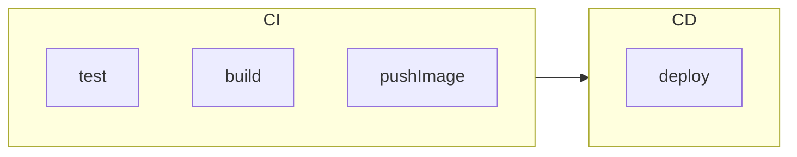

# GitOps with Argo CD

## Traditional CI/CD workflows

Traditional CI/CD workflows consists in two steps:

- Test, build, and push images to a container repository (CI)
- Deploy the application to the environment (CD)

This adoption addresses some challenges during deployment:

- Install tools used in pipelines
    - `kubectl`
    - Cloud CLIs (`aws-cli`, `azure-cli` and so on)
    - etc
- Manage cloud credentials
- Manage `kubectl` access
- Manage external tools access (if have 5 external tools, need to manage 5 accesses)
- If the deployment creates cloud resources, it need to be executed every time you want to create those resources.

## What is GitOps?

GitOps is a framework that defines [Git](https://git-scm.com/) as the **Single Source of Truth (SST)**. This way, a repository reflects **exactly** what should be in the environment. It automates the provision of everything an application needs to run (_X as code_).

### Benefits

- **Environment transparency**: The environment **will match what**
is defined in your Git repository.

- **Fast recovery/easy rollbacks**: If anything goes wrong, you can
simple apply a `git revert` and the previous state will be applied
to the environment.

- **Security**: You can control application resources provisioning
via `RBAC roles`. No need to external service for deployment.

- **Reliability**: If an application resource is directly removed,
the _reconcile_ process will recreate the resource since it needs
to match the desired state.

## Argo

Argo CD is a pull model strategy, GitOps operator that automatically syncs (_reconcile_)
the application resources.

It takes a desired state (defined in the Git repository) and make changes to the current state to match the desired state.

Applies Kubernetes manifests.

- Access control is made via the Git permissions, no need to create
ClusterRoles and User in k8s.

## Useful links

- [Devops Journey - Explaining GitOps](https://www.youtube.com/watch?v=dIaX5IhRqkI)